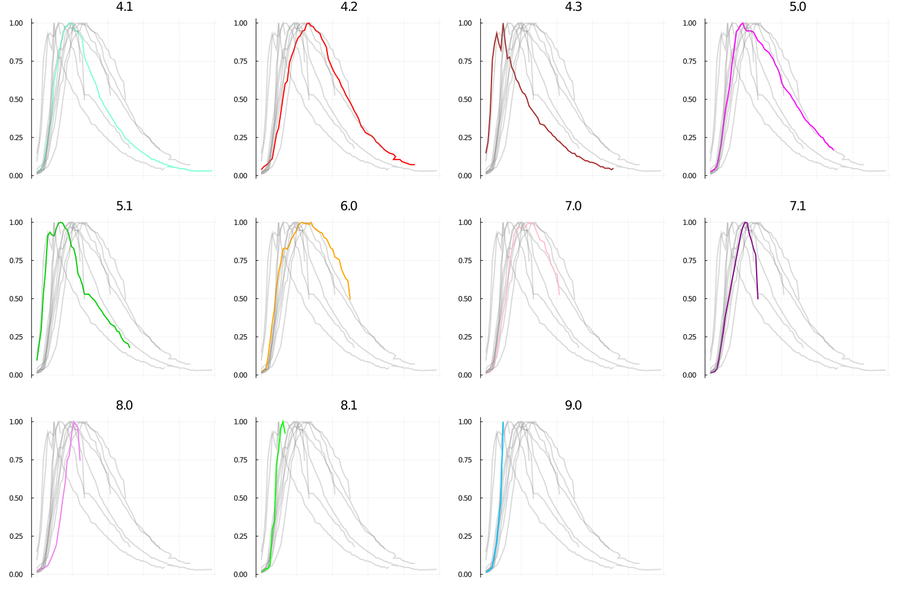
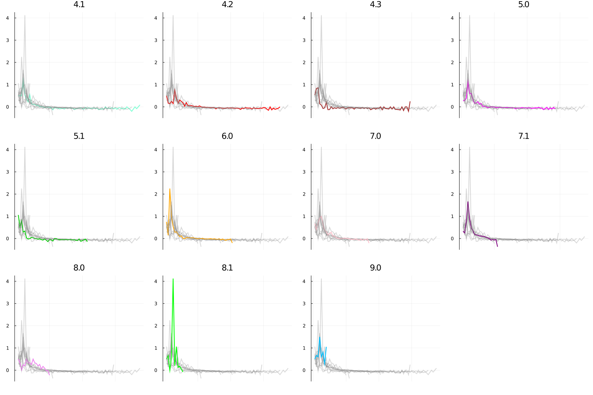

# Android version distribution

The graphs around the internet doesn't adjust each version by its year of launch. This one compares the percentage usage over the number of months after its first appearance.

Source: androidpolice

## Percentage of peak usage by time since launch

## Percentage change

